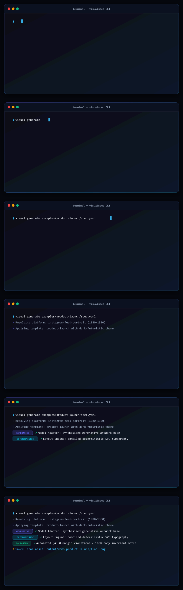

# VisualSpec

> **Deterministic visual generation for AI agents.**  
> AI creates the imagery. VisualSpec guarantees the typography and layout.

<p align="center">
  
</p>

<p align="center">
  <a href="https://www.npmjs.com/package/@utkarshx27/visualspec"></a>
  <a href="https://registry.modelcontextprotocol.io"></a>
  <a href="LICENSE"></a>
  
  <a href="https://github.com/utkarshx27/visualspec"></a>
</p>

```bash
# Instant workspace setup (no clone required)
npx @utkarshx27/visualspec init

# Launch local MCP Server for Cursor, Claude Desktop, or Antigravity
npx @utkarshx27/visualspec mcp
```

---

##  The Core Problem

Most image-generation workflows fail for social and marketing graphics because a single natural-language prompt is expected to handle too many concerns at once:
- subject & background
- exact typography & wording
- platform dimensions & safe margins
- visual hierarchy & negative space
- brand color rules & constraints

Image models frequently hallucinate gibberish text, truncate words, or disregard composition rules.

##  The Solution: Layer Separation

**VisualSpec** separates generative concerns from deterministic concerns:

1. **Generative Layers (AI Models)**: Photography, 3D subjects, atmospheric backgrounds, textures, lighting.
2. **Deterministic Layers (Code & SVG Engine)**: Exact headlines, subtitles, badges, logos, metrics, safe margins, and layout rules.
3. **Structured Visual Spec**: A machine-readable YAML specification that acts as the single contract.
4. **Visual QA & Targeted Repair**: Verifies geometry, margins, and exact copy invariants, synthesizing localized repairs without regenerating entire scenes.

```text
User Brief / Intent
       │
       ▼
   Visual Spec (spec.yaml)
       │
   ┌───┴──────────────┐
   ▼                  ▼
Platform Pack    Template Pack
   │                  │
   └───┬──────────────┘
       ▼
   Spec Resolver
       │
   ┌───┴───────────────────────┐
   ▼                           ▼
Model Adapter           Deterministic Layout
(Generative Base)       (SVG Typography / Overlay)
   │                           │
   └───┬───────────────────────┘
       ▼
  Compositor (Sharp)
       │
       ▼
   Visual QA (Constraints, Safe Margins, Exact Copy)
       │
       ├── PASS ──► Final Asset Bundle
       │
       └── FAIL ──► Targeted Repair Planner
```

---

##  Documentation

- [Architecture & Design Principles](docs/architecture.md)
- [VisualSpec Schema & Contract](docs/visual-spec.md)
- [MCP Server Setup (Cursor, Claude, Antigravity)](docs/mcp-setup.md)
- [Adding a New Image Model Provider](docs/adding-a-new-provider.md)
- [Contributing Guidelines](CONTRIBUTING.md)

---

##  Quickstart

### Instant Run (No Install Required)

```bash
# Initialize a new VisualSpec workspace
npx @utkarshx27/visualspec init

# Launch local MCP Server for Cursor, Claude, or Antigravity IDE
npx @utkarshx27/visualspec mcp
```

### Or Install Globally

```bash
npm install -g @utkarshx27/visualspec

# Use CLI commands directly
visual init
visual mcp
```

### Or Build from Source

```bash
git clone https://github.com/utkarshx27/visualspec.git
cd visualspec
npm install
npm run build
```

### 1. Initialize a Project

```bash
npx @utkarshx27/visualspec init
```

### 2. Validate a Visual Spec

```bash
npx @utkarshx27/visualspec validate examples/product-launch/spec.yaml
```

### 3. Inspect the Compiled Generation Prompt

```bash
npx @utkarshx27/visualspec compile examples/product-launch/spec.yaml --provider openai
```

### 4. Deterministic Render (No API Key Required)

Render layout, typography, and background styling locally:

```bash
npx @utkarshx27/visualspec render examples/product-launch/spec.yaml --output ./output/demo-launch
```

### 5. Run the Full Generation Pipeline

```bash
npx @utkarshx27/visualspec generate examples/product-launch/spec.yaml --provider mock --output ./output/demo-launch
```

### 6. Verify Asset Quality with Visual QA

```bash
npx @utkarshx27/visualspec check ./output/demo-launch/final.png --spec examples/product-launch/spec.yaml
```

---

##  Model Context Protocol (MCP) Server

VisualSpec runs as a native MCP server over `stdio`, enabling AI coding assistants (Cursor, Claude Code, Gemini CLI, and Antigravity IDE) to invoke visual tools directly:

```bash
# Launch MCP server over stdio
npx @utkarshx27/visualspec mcp

# Or if installed globally
visual mcp
```

### Available MCP Tools
- `visual_brief_to_spec`: Convert natural language requests into valid VisualSpec YAML.
- `visual_validate_spec`: Schema validation for specs.
- `visual_render`: Deterministic layout & typography rendering (zero API key).
- `visual_generate`: Full image model adapter + deterministic text overlay pipeline.
- `visual_check_qa`: Inspect safe margins, line counts, dimensions, and invariants.
- `visual_repair`: Automated diagnosis and localized typography/layout repair.
- `visual_list_resources`: List supported platform packs and templates.

See the [MCP Setup Guide](docs/mcp-setup.md) for Cursor, Claude Desktop, and Antigravity IDE configuration snippets.

---

##  Output Bundle

Every generation creates a complete, reproducible debug bundle:

```text
output/demo-launch/
├── final.png                 # Platform-ready asset
├── visual-spec.yaml          # Original input specification
├── resolved-spec.yaml        # Full spec with platform & template rules applied
├── generation-request.json   # Exact prompt and negative parameters sent to model
├── qa-report.json            # Deterministic and constraint QA verification results
└── metadata.json             # Execution timestamps and file index
```

---

##  Supported Platforms & Templates

### Platforms
- **Instagram**: Feed portrait (1080x1350, 4:5), Square (1080x1080, 1:1), Story (1080x1920, 9:16).
- **LinkedIn**: Feed portrait (1080x1350), Square (1080x1080), Banner (1200x628).
- **Generic Social**: Universal 1:1, 4:5, and 16:9 social formats.

### Templates
- **Product Launch**: High-impact headline, feature pill, product visual region, supporting subhead.
- **Quote Card**: Center-focused editorial quote, author attribution, minimal atmospheric glow.
- **Stat Card**: Large numeric hero metric, descriptive label, and data context notes.

---

##  Agent Skills

The framework includes 10 standardized skill definitions located in `./skills/`:
- `using-visualspec`: Master workflow instructions.
- `visual-brief`: Brief extraction and analysis.
- `visual-spec`: YAML authoring and schema rules.
- `composition`: Spatial hierarchy and negative space allocation.
- `typography`: Font family classing and line budgeting.
- `strict-constraints`: Invariant taxonomy and forbidden parameters.
- `social-instagram`: Instagram-specific design reasoning.
- `social-linkedin`: LinkedIn-specific design reasoning.
- `visual-qa`: Automated inspection and validation.
- `visual-repair`: Localized diagnosis and patch generation.

---

##  Roadmap & Open Contributions

We welcome contributions! Key areas to build together:
- [ ] **Additional Platforms**: X/Twitter (Header, Post), YouTube Thumbnails, Pinterest, TikTok Cover.
- [ ] **Additional Templates**: Testimonial, Product Comparison, Event Announcement, Feature List.
- [ ] **Additional Image Model Adapters**: Flux, Stable Diffusion / ComfyUI, Midjourney API.
- [ ] **Brand Packs**: Multi-brand palette overrides, custom font loading, logo clear space rules.
- [ ] **Visual Studio**: Local web playground / viewer for real-time spec inspection and margin toggling.

---

##  Contributing

Contributions are welcome! Please check our:
- [Contributing Guidelines](CONTRIBUTING.md)
- [Code of Conduct](CODE_OF_CONDUCT.md)

---

##  Testing

Run the automated test suite:

```bash
npm test
```

All 28 tests run offline without requiring any third-party API keys.

---

##  License

Licensed under the [Apache License, Version 2.0](LICENSE).
